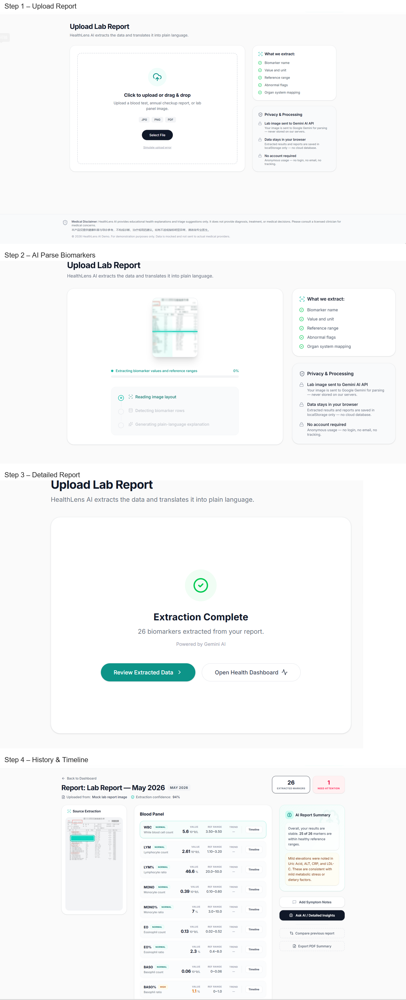
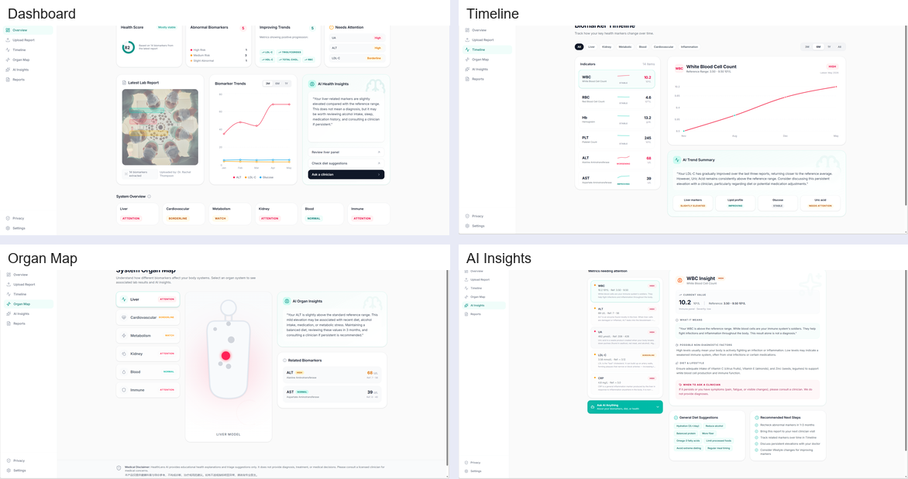
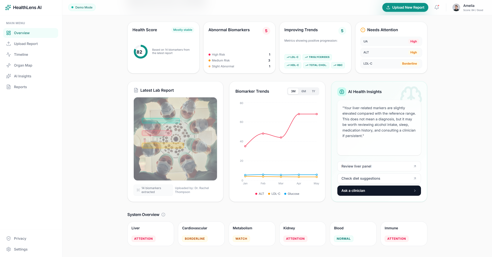
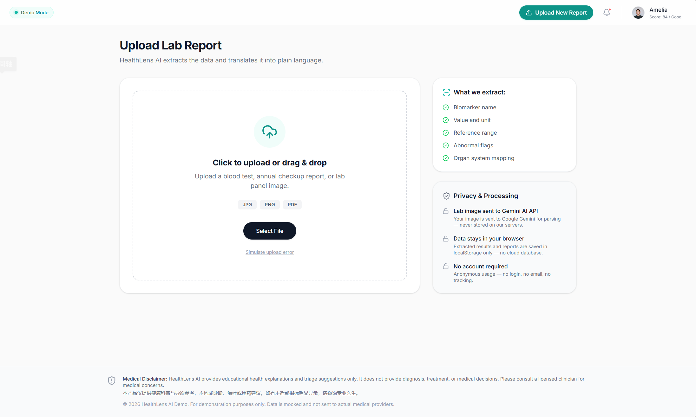
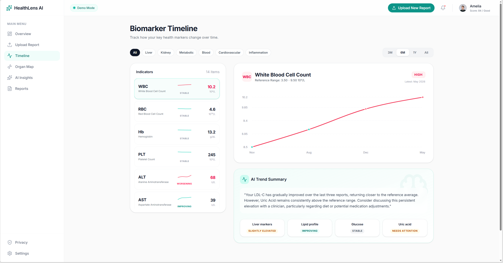
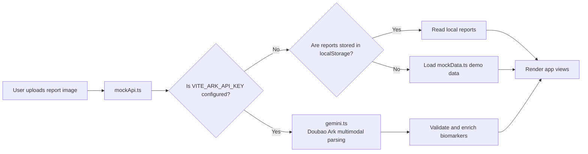

<div align="center">

[中文](./README.md)

<br>

[Project Logo]

# HealthLens AI 🔎

---

**A purpose-built AI health companion for understanding blood test reports.**

Upload a lab report image, and HealthLens AI extracts key biomarkers, labels their health status, and explains the results in plain language. It is designed for people who want to organize checkup data, follow trends over time, and prepare better questions before talking to a clinician.

<br>


<br>



</div>

<br>

> Tip  
> To get the app running quickly, use `npm install` and `npm run dev`. Without an API key, the app automatically falls back to demo mode.

<br>

## Overview 🧭

HealthLens AI is a React single-page app that turns blood test reports from dense medical tables into readable, trackable, and discussion-ready health information. It can ingest a report image, extract 14 common blood and metabolic biomarkers, and display the results across a dashboard, detail view, timeline, and organ map.

The project currently supports built-in demo data and browser-local persistence by default. Real AI extraction can be enabled through Volcengine Ark / Doubao. Parsed reports are stored in browser `localStorage`, making the project useful for product prototyping, health-data UI exploration, and learning how AI-assisted frontend apps are structured.

<br>

## Why this exists 💡

Blood test reports are information-dense, but most people cannot quickly tell which markers are fine, which need monitoring, and which questions should be brought to a doctor.

HealthLens AI breaks that process into three clear steps: extract structured biomarkers, map them to body systems, and explain the result in everyday language. It is not a diagnostic tool; it is a comprehension layer that helps users prepare for better medical conversations.

<br>

## Key Features ✨

- **Report upload and parsing**: Upload a lab report image and, with an API key configured, use Doubao Ark for multimodal recognition and structured extraction.
- **Demo mode by default**: Without an API key, the app uses Amelia's mock report data so the core experience still works.
- **Biomarker status grading**: Marks biomarkers as `normal`, `borderline`, `high`, or `low`, and calculates an overall health score.
- **Report detail view**: Shows measured values, reference ranges, status, trend data, and plain-language explanations.
- **Historical trend tracking**: Compares biomarker values across multiple dates with line charts.
- **Organ system view**: Groups markers by liver, kidney, blood, cardiovascular, metabolic, and immune systems.
- **AI health insights**: Generates summaries, watch items, lifestyle suggestions, and safety reminders from report data.
- **Local report management**: View and delete reports saved in browser storage.

<br>

## Demo / Screenshots 📸

### Main Flow



The primary flow starts from the landing page, moves through upload and parsing, then opens dashboard and trend views for interpretation.

### Dashboard



The dashboard brings together health score, organ-system status, markers that need attention, and trend summaries so users see the conclusion before the details.

### Report Detail



The report detail page presents each biomarker as a focused card with value, range, status, and explanation text.

### Trends and Organ Map




The timeline focuses on change over time, while the organ map restores scattered biomarkers to body-system context.

### AI Insights


The AI insights page organizes abnormal markers, possible reasons, lifestyle suggestions, and medical safety reminders into a readable explanation.

<br>

## How it works ⚙️



The core flow has four layers:

| Layer | Files | Role |
| --- | --- | --- |
| Routing and pages | `src/App.tsx`, `src/pages/*` | Organizes landing, upload, dashboard, report detail, timeline, organ map, and insights pages |
| API routing layer | `src/lib/mockApi.ts` | Switches between real AI, local storage, and demo data |
| AI service layer | `src/lib/gemini.ts` | Historically named Gemini; currently calls Doubao Ark through an OpenAI-compatible SDK |
| Data model layer | `src/lib/types.ts`, `src/lib/mockData.ts` | Defines biomarker structures, mock reports, trend data, and organ-system summaries |

<br>

## Quick Start 🚀

### 1. Install dependencies

```bash
npm install
```

### 2. Start the dev server

```bash
npm run dev
```

### 3. Open the app

Visit [http://localhost:3000](http://localhost:3000).

### 4. Optional: enable real AI parsing

```bash
cp .env.example .env.local
```

Fill in `.env.local`:

```env
VITE_ARK_API_KEY="your_ark_api_key_here"
ARK_API_KEY="your_ark_api_key_here"
```

Then restart:

```bash
npm run dev
```

<br>

## Usage 🛠️

### Demo mode

1. Run `npm run dev`.
2. Leave the API key unset and open the app.
3. Explore the dashboard, report detail, timeline, organ map, and AI insights pages.

### Real parsing mode

1. Add `VITE_ARK_API_KEY` to `.env.local`.
2. Open `/upload`.
3. Upload a clear blood test report image.
4. Wait for parsing to complete, then review the extracted biomarkers in the report detail page.

### Manage historical reports

1. Open `/reports` to see saved reports.
2. Open a report to inspect its details.
3. Delete local report records that are no longer needed.

<br>

## Configuration 🧰

| Option | Default | Required | Purpose |
| --- | --- | --- | --- |
| `VITE_ARK_API_KEY` | Not set | No | Vite frontend env var for enabling Doubao Ark real parsing |
| `ARK_API_KEY` | Not set | No | Fallback variable name for some deployment environments |
| `healthlens_reports` | `[]` | Generated automatically | Browser `localStorage` key for saved reports |
| `healthlens_parsing` | `{}` | Generated automatically | Browser `localStorage` key for in-flight parsing state |

When no API key is configured, the app automatically uses built-in mock data and remains fully usable for local exploration.

<br>

## Architecture 🧩

### Tech Stack

| Type | Technology |
| --- | --- |
| Frontend framework | React 19 |
| Build tool | Vite 6 |
| Language | TypeScript 5 |
| Styling | Tailwind CSS 4 |
| Routing | React Router DOM 7 |
| Charts | Recharts |
| Icons | Lucide React |
| AI SDK | OpenAI JS SDK |
| AI service | Volcengine Ark / Doubao Seed 2.0 Lite |

### Project Structure

```text
healthlens-ai/
├── src/
│   ├── components/
│   │   └── layout/
│   ├── pages/
│   ├── lib/
│   │   ├── gemini.ts
│   │   ├── mockApi.ts
│   │   ├── mockData.ts
│   │   └── types.ts
│   ├── App.tsx
│   ├── main.tsx
│   └── index.css
├── picture/
├── public/
├── .env.example
├── package.json
├── tsconfig.json
├── vite.config.ts
└── README.md
```

<br>

## Roadmap 🗺️

- [ ] Add a human correction flow after real report parsing.
- [ ] Add PDF export or report sharing.
- [ ] Improve multi-report comparison and abnormal-marker ranking.
- [ ] Add focused unit tests for upload parsing, report detail, and AI insights.
- [ ] Clean up historical names such as `gemini.ts` and align them with the Ark / AI service implementation.

<br>

## FAQ ❓

### Can HealthLens AI replace a doctor?

No. It is for understanding health information and preparing for care conversations. It does not provide diagnosis, treatment, or medication advice.

### Can I use it without an API key?

Yes. The app enters demo mode and uses built-in Amelia report data to show the full experience.

### Is my data uploaded to a server?

By default, no. Report records are stored in browser `localStorage`. When real AI parsing is enabled, the uploaded image is sent to the configured Ark model service for extraction.

### Which report formats are supported?

The current code path is primarily designed for image uploads. Use clear JPG or PNG report images with even lighting and unobstructed text.

### Why is the file named `gemini.ts` if the README says Doubao Ark?

That is a historical naming artifact. The current implementation uses an OpenAI-compatible SDK to call Volcengine Ark / Doubao, and the environment variables use `ARK` names.

<br>

## Contributing 🤝

Issues and pull requests are welcome. A minimal contribution flow:

1. Fork the repository.
2. Create a branch: `git checkout -b feature/your-change`.
3. Run locally: `npm run lint` and `npm run build`.
4. Commit with a clear message.
5. Open a pull request with the motivation and verification notes.

<br>

## License 📄

`[License]`

This repository does not currently include a standalone LICENSE file, and historical docs and code comments contain different license signals. Maintainers should add an explicit license before a formal release.

<br>

## Contact 📬

- Repository: [dakjdakd/healthlens-ai](https://github.com/dakjdakd/healthlens-ai)
- Maintainer: `[Maintainer]`
- Documentation: `[Docs URL]`
- Contact: `[Contact]`
