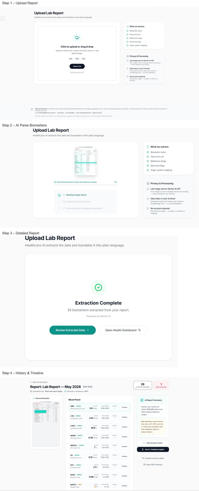
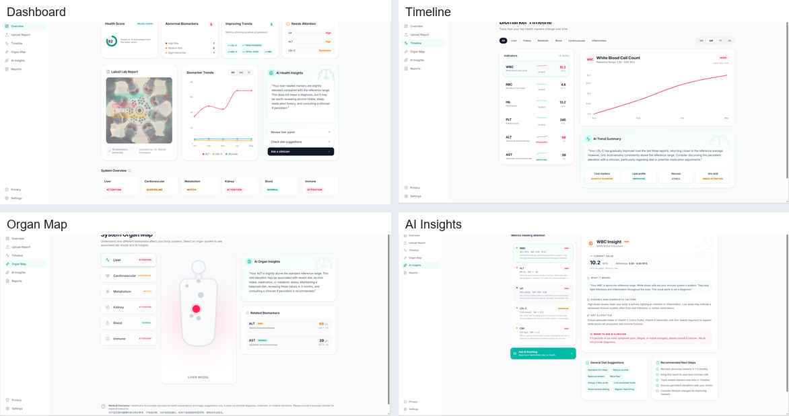
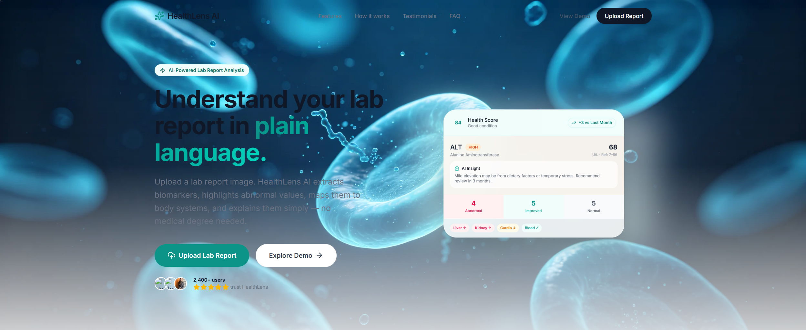
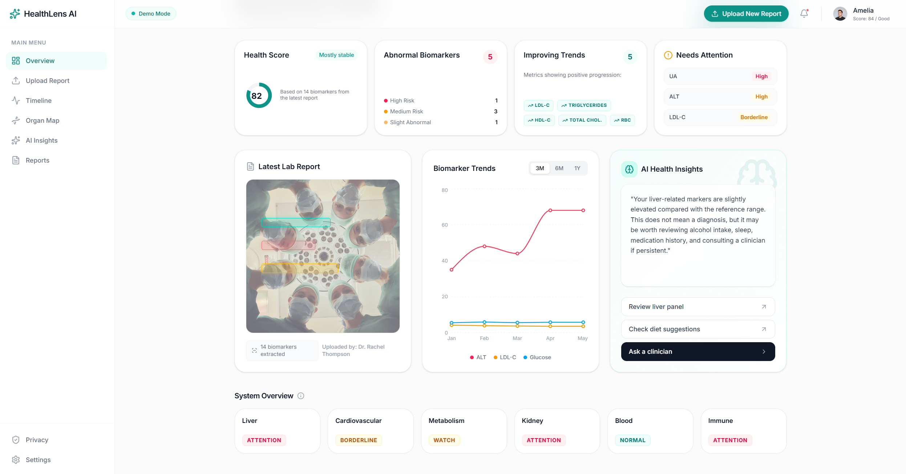
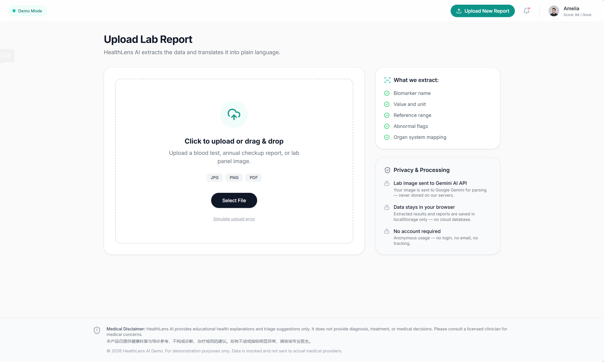
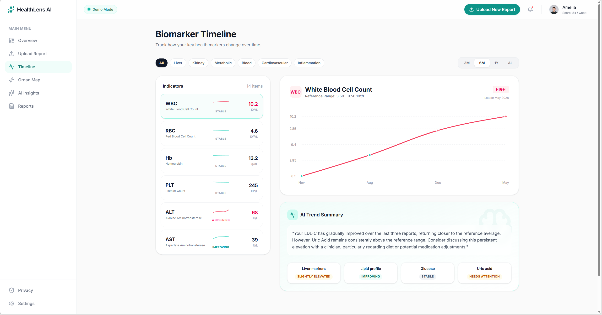
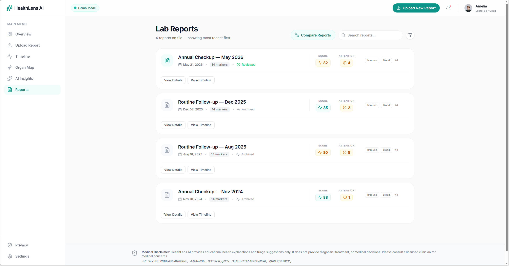
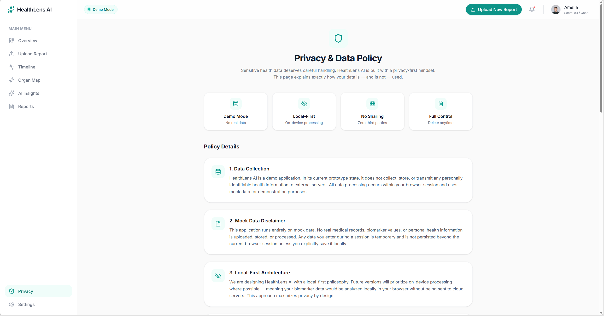

# HealthLens AI — 智能血检报告解读助手

<div align="center">


[](https://opensource.org/licenses/MIT)
[](https://react.dev)
[](https://www.typescriptlang.org)
[](https://vitejs.dev)

**上传血检报告图片，AI 自动提取指标数据并提供通俗易懂的健康解读**

[🏠 在线体验](#在线体验) · [✨ 功能介绍](#功能介绍) · [🚀 快速开始](#快速开始) · [🗂️ 项目结构](#项目结构) · [🛠️ 技术栈](#技术栈) · [🤝 贡献指南](#贡献指南) · [⚠️ 免责声明](#免责声明) · [📄 开源协议](#开源协议)

</div>

---

## 🏠 在线体验

> 💡 **无需 API Key** — 应用内置了丰富的演示数据（用户 Amelia，2026年5月21日报告），可直接体验所有功能，无需任何配置。

👉 **项目地址：** [https://github.com/dakjdakd/healthlens-ai](https://github.com/dakjdakd/healthlens-ai)

本地运行：

```bash
git clone https://github.com/dakjdakd/healthlens-ai.git
cd healthlens-ai
npm install
npm run dev
```

然后访问 [http://localhost:5173](http://localhost:5173)

---

## ✨ 功能介绍

### 🔄 完整操作流程

上传一张血检报告图片，AI 自动完成从数据提取到健康解读的全流程：

<div align="center">

</div>

| 步骤 | 说明 |
|---|---|
| **① 上传报告** | 拖拽或选择血检报告图片文件 |
| **② AI 解析** | Gemini AI 自动识别并提取 14 项生物标志物数据 |
| **③ 查看报告详情** | 每项指标的数值、参考范围、状态（正常/临界/异常）及通俗解释 |
| **④ 历史与趋势** | 多报告时间轴折线图，直观展示指标变化趋势 |

### 📱 功能模块一览

<div align="center">

</div>

| 功能模块 | 说明 |
|---|---|
| 📄 **首页 (Landing)** | 应用入口，展示核心价值主张与快速上手入口 |
| 📊 **健康仪表盘 (Dashboard)** | 综合健康评分、各器官系统状态概览、趋势摘要（改善/稳定/需关注） |
| 📤 **上传报告 (Upload)** | 拖拽或选择血检报告图片，AI 自动识别提取 14 项生物标志物数据 |
| 📋 **报告详情 (ReportDetail)** | 每项指标的结果、参考范围、状态（正常/临界/异常）及通俗解释 |
| 📈 **历史趋势 (Timeline)** | 多报告时间轴折线图，直观展示各项指标的历史变化趋势 |
| 🗺️ **器官地图 (OrganMap)** | 人体示意图，按器官系统分类展示相关指标及热点提示 |
| 💡 **AI 解读 (Insights)** | 基于大语言模型，提供通俗语言健康分析与可操作建议 |
| 📁 **报告列表 (Reports)** | 管理所有已上传的历史报告，支持查看与删除 |
| ⚙️ **设置 (Settings)** | 管理个人信息、报告医院来源等 |
| 🔒 **隐私政策 (Privacy)** | 隐私保护说明（所有数据均存储在本地 localStorage） |

---

### 📊 核心页面展示

#### 🏠 首页 (Landing)

<div align="center">

</div>

应用入口首页，展示核心价值主张「Understand your lab report in plain language」，包含 AI 功能徽章、CTA 按钮组及实时数据预览卡片。

---

#### 📊 健康仪表盘 (Dashboard)

<div align="center">

</div>

综合健康评分、各器官系统状态概览，清晰展示指标改善/稳定/需关注的趋势。

---

#### 📋 报告详情 (ReportDetail)

<div align="center">

</div>

每项生物标志物的详细数据卡片，包含：检测值、参考范围、健康状态标签（正常/临界/异常）及 AI 生成的个人化解读。

---

#### 📈 历史趋势 (Timeline)

<div align="center">

</div>

支持切换不同指标、多报告对比，直观呈现各项指标在时间轴上的变化。

---

#### 🗺️ 器官地图 (Organ Map)

<div align="center">

</div>

以人体示意图为载体，按器官系统分类展示相关指标，点击器官即可查看其健康状态。

---

#### 💡 AI 解读 (AI Insights)

<div align="center">

</div>

基于大语言模型，对整体健康状况进行通俗语言分析，并提供可操作的健康建议。

---

#### 📁 报告列表 (Reports)

<div align="center">

</div>

集中管理所有已上传的历史报告，支持查看详情与删除操作。

---

#### 🔒 隐私政策 (Privacy)

<div align="center">

</div>

所有报告数据均存储在浏览器 `localStorage` 中，完全本地化处理，不会上传至任何服务器。

---

### 🩸 14 项追踪指标

| 分类 | 指标 | 说明 |
|---|---|---|
| 🩸 血液系统 | WBC、RBC、血红蛋白、血小板 | 免疫功能、氧气运输、凝血功能 |
| 🦠 肝脏 | ALT、AST | 肝酶，反映肝功能状态 |
| 🫘 肾脏 | 肌酐、尿酸 | 肾功能与代谢废物清除 |
| ❤️ 心血管 | 总胆固醇、HDL、LDL、甘油三酯 | 血脂四项，评估心血管风险 |
| ⚡ 代谢 | 空腹血糖 | 血糖管理，糖尿病筛查 |
| 🔥 炎症 | CRP（C反应蛋白） | 非特异性炎症标志物 |

### 🎨 健康状态等级

| 状态 | 颜色 | 含义 |
|---|---|---|
| ✅ **正常 (Normal)** | 🟢 绿色 | 指标在健康参考范围内 |
| ⚠️ **临界 (Borderline)** | 🟡 黄色 | 接近参考范围边界，需持续观察 |
| 🔴 **偏高 / 偏低 (High/Low)** | 🔴 红色 | 显著超出参考范围，建议咨询医生 |

**综合健康评分**：根据所有指标的严重程度加权计算，满分 100 分。

---

## 🚀 快速开始

### 环境要求

- **Node.js** ≥ 18
- **npm** ≥ 9

### 步骤一 — 克隆项目

```bash
git clone https://github.com/dakjdakd/healthlens-ai.git
cd healthlens-ai
```

### 步骤二 — 安装依赖

```bash
npm install
```

### 步骤三 — 启动开发服务器（默认演示模式）

```bash
npm run dev
```

> 💡 应用内置演示数据，无需配置 API Key 即可体验全部功能。

### 步骤四 — 配置 AI 能力（可选，体验真实解析）

如需使用真实 AI 解析功能，请按以下步骤配置：

**1. 获取 API Key**

前往 [火山引擎 Ark 控制台](https://console.volcengine.com/ark) 注册并创建密钥（有免费额度）。

**2. 配置环境变量**

```bash
cp .env.example .env.local
```

编辑 `.env.local`：

```env
# 火山引擎 Ark API Key
VITE_ARK_API_KEY=your_ark_api_key_here
```

**3. 重启开发服务器**

```bash
npm run dev
```

访问 [http://localhost:5173](http://localhost:5173)

### 可用命令

| 命令 | 说明 |
|---|---|
| `npm run dev` | 启动开发服务器 |
| `npm run build` | 构建生产版本 |
| `npm run preview` | 本地预览生产版本 |
| `npm run lint` | ESLint 类型检查 |
| `npm run test` | Vitest 单元测试 |

---

## 🗂️ 项目结构

```
healthlens-ai/
├── src/
│   ├── components/           # 可复用 UI 组件
│   │   ├── Disclaimer.tsx    # 免责声明组件
│   │   └── layout/
│   │       ├── MainLayout.tsx  # 页面主布局（侧边栏 + 顶部栏）
│   │       ├── Sidebar.tsx     # 导航侧边栏
│   │       └── Topbar.tsx      # 顶部标题栏
│   │
│   ├── pages/               # 路由页面组件
│   │   ├── Landing.tsx       # 首页
│   │   ├── Dashboard.tsx     # 健康仪表盘
│   │   ├── Upload.tsx        # 上传并解析报告
│   │   ├── ReportDetail.tsx  # 报告详情
│   │   ├── Timeline.tsx      # 历史趋势图
│   │   ├── OrganMap.tsx      # 人体器官地图
│   │   ├── Explanation.tsx   # AI 健康解读
│   │   ├── Reports.tsx       # 报告列表管理
│   │   ├── Settings.tsx      # 个人设置
│   │   └── Privacy.tsx       # 隐私政策
│   │
│   ├── lib/
│   │   ├── gemini.ts         # AI 服务（报告图像解析 + 智能解读）
│   │   ├── mockApi.ts        # API 路由层（自动选择真实/模拟/存储模式）
│   │   ├── mockData.ts       # 演示数据（用户 Amelia，2026年5月21日报告）
│   │   └── types.ts          # 共享 TypeScript 类型定义
│   │
│   ├── App.tsx               # 根组件 + 路由配置
│   ├── main.tsx              # 应用入口
│   └── index.css             # 全局样式 + Tailwind CSS
│
├── public/                   # 静态资源（Vite 公开目录）
├── picture/                  # README 展示图片
├── .env.example              # 环境变量模板（可安全提交）
├── .gitignore                # 排除 .env.local、node_modules、构建产物
├── package.json
├── tsconfig.json
├── vite.config.ts
└── README.md
```

---

## ⚙️ 数据流架构

应用在运行时自动选择后端模式，无需手动切换：

```
用户操作
    │
    ▼
mockApi.ts  ── 是否配置了 VITE_ARK_API_KEY？
    │
    ├─── 已配置 ──→  gemini.ts  ──→  火山引擎 Ark 真实解析
    │
    └─── 未配置 ── localStorage 中是否有已保存的报告？
                │
                ├─── 有 ──→  从 localStorage 读取历史报告
                │
                └─── 无 ──→  mockData.ts  ──→  演示模式
```

### 三种运行模式

| 模式 | 触发条件 | 数据来源 |
|---|---|---|
| **真实解析** | 配置了 `VITE_ARK_API_KEY` | 火山引擎 Ark AI |
| **本地存储** | 无 API Key 但有历史报告 | 浏览器 localStorage |
| **演示模式** | 无 API Key 且无历史报告 | 内置 mock 数据 |

### 本地存储说明

- 所有上传的报告以 JSON 格式存储在浏览器 `localStorage` 中
- 存储键名：`healthlens_reports`
- 数据不会上传至任何服务器，完全隐私
- 删除浏览器缓存将清除所有报告数据

---

## 🛠️ 技术栈

| 层级 | 技术选型 | 说明 |
|---|---|---|
| **前端框架** | React 19 + Vite 6 | 现代化组件化开发 |
| **开发语言** | TypeScript 5 | 类型安全 |
| **样式方案** | Tailwind CSS 4 | 原子化 CSS |
| **路由管理** | React Router v7 | SPA 路由 |
| **图表可视化** | Recharts | 趋势图、仪表盘 |
| **AI 引擎** | 豆包 Doubao Seed 2.0 / Gemini | 通过火山引擎 Ark 调用 |
| **AI SDK** | OpenAI JS SDK | 配置 `baseURL` 为豆包端点 |
| **图标库** | Lucide React | 轻量级图标 |

---

## ❓ 常见问题

### Q: HealthLens AI 可以替代看医生吗？

**不可以。** HealthLens AI 是辅助理解血检报告的教育工具，提供通俗语言解释和一般性生活方式建议，但不能替代专业医疗诊断、治疗方案或处方建议。有任何健康问题请咨询您的医生。

### Q: 我的健康数据会保存在服务器上吗？

**不会。** 所有数据存储在浏览器 `localStorage` 中，不会上传至任何外部服务器，完全由您自己掌控。

### Q: 如何实现 OCR 和生物标志物提取？

HealthLens AI 使用多模态 AI 模型分析血检报告图片，提取生物标志物名称、数值、单位及参考范围，然后映射到身体器官系统并生成通俗语言解释。演示模式下使用模拟数据。

### Q: 支持哪些格式的血检报告？

支持标准临床血检报告的图片格式（JPG、PNG）和 PDF 文件。建议照片拍摄时：光线充足、纸张平整、文字清晰，以获得最佳提取效果。

### Q: 可以追踪多项指标的历史变化吗？

**可以！** 时间轴页面支持跨报告追踪单个生物标志物的变化趋势，帮助您和医生了解生活方式改变对健康指标的影响。

### Q: 这项服务免费吗？

当前原型版本完全免费使用。未来可能引入高级功能（如高级趋势分析、个性化健康指导等）的免费增值模式。

### Q: 忘记配置 API Key 会有什么问题？

没有任何问题。应用会自动切换到演示模式，使用内置的模拟数据（用户 Amelia，2026年5月21日报告）展示所有功能。

---

## 🤝 贡献指南

欢迎提交 Issue 和 Pull Request！

1. **Fork** 本仓库
2. 创建功能分支：`git checkout -b feature/your-feature`
3. 提交更改：`git commit -m 'Add some feature'`
4. 推送分支：`git push origin feature/your-feature`
5. 提交 Pull Request

---

## ⚠️ 免责声明

> **HealthLens AI 仅提供健康信息参考，不构成医疗建议。**
>
> 应用内的所有解读、分析和建议均来自 AI 模型，不能替代专业医疗诊断、治疗或建议。若有任何健康疑问，请及时咨询合格的医疗专业人员。血检结果的解读需要结合个人病史、体征和其他检查结果，由医生综合判断。

---

## 📄 开源协议

MIT License

Copyright (c) 2026 HealthLens AI

Permission is hereby granted, free of charge, to any person obtaining a copy
of this software and associated documentation files (the "Software"), to deal
in the Software without restriction, including without limitation the rights
to use, copy, modify, merge, publish, distribute, sublicense, and/or sell
copies of the Software, and to permit persons to whom the Software is
furnished to do so, subject to the following conditions:

The above copyright notice and this permission notice shall be included in all
copies or substantial portions of the Software.

THE SOFTWARE IS PROVIDED "AS IS", WITHOUT WARRANTY OF ANY KIND, EXPRESS OR
IMPLIED, INCLUDING BUT NOT LIMITED TO THE WARRANTIES OF MERCHANTABILITY,
FITNESS FOR A PARTICULAR PURPOSE AND NONINFRINGEMENT. IN NO EVENT SHALL THE
AUTHORS OR COPYRIGHT HOLDERS BE LIABLE FOR ANY CLAIM, DAMAGES OR OTHER
LIABILITY, WHETHER IN AN ACTION OF CONTRACT, TORT OR OTHERWISE, ARISING FROM,
OUT OF OR IN CONNECTION WITH THE SOFTWARE OR THE USE OR OTHER DEALINGS IN THE
SOFTWARE.