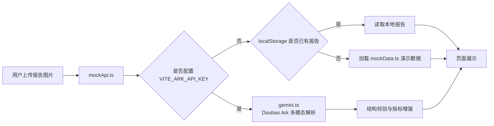

<div align="center">

[English](./README.en.md)

<br>

[Project Logo]

# HealthLens AI 🔎

---

**一个专为血检报告理解而生的 AI 健康解读应用。**

上传一张实验室检查报告图片，HealthLens AI 会提取关键生物标志物、标注健康状态，并用更容易理解的语言解释结果。它面向希望整理体检数据、追踪指标趋势、并在就医前先看懂报告的人群。

<br>


<br>


</div>

<br>

> Tip  
> 如果你只想最快跑起来，可以直接执行 `npm install` 和 `npm run dev`。未配置 API Key 时，应用会自动进入演示模式。

<br>

## 项目概览 🧭

HealthLens AI 是一个 React 单页应用，用于把血检报告从“专业表格”转成“可读、可追踪、可讨论”的健康信息。它支持上传报告图片，解析 14 类常见血液与代谢指标，并在仪表盘、报告详情、趋势图和器官地图中展示结果。

项目当前以内置演示数据和浏览器本地存储为主，也可以通过火山引擎 Ark / Doubao 模型启用真实 AI 解析。所有已解析报告默认保存到浏览器 `localStorage`，适合原型演示、健康数据产品验证和前端 AI 应用学习。

<br>

## 为什么做这个 💡

血检报告通常信息密度很高，但普通用户很难快速判断哪些指标正常、哪些需要持续观察、哪些问题应该带去问医生。

HealthLens AI 试图把这个过程拆成三件清晰的事：先提取结构化指标，再把指标映射到身体系统，最后用通俗语言解释风险和下一步。它不是诊断工具，而是一个帮助用户更好准备医疗沟通的理解层。

<br>

## 核心功能 ✨

- **报告上传与解析**：支持上传血检报告图片，配置 API Key 后可调用 Doubao Ark 进行多模态识别与结构化提取。
- **演示模式开箱可用**：未配置 API Key 时自动使用 Amelia 的模拟报告数据，仍可体验核心页面和交互。
- **指标状态分级**：将生物标志物标记为 `normal`、`borderline`、`high` 或 `low`，并计算综合健康分数。
- **报告详情视图**：展示检测值、参考范围、状态、趋势数据和通俗解释。
- **历史趋势追踪**：用折线图比较多个时间点的指标变化，帮助观察改善、稳定或恶化。
- **器官系统视图**：按肝脏、肾脏、血液、心血管、代谢和免疫系统归类指标。
- **AI 健康解读**：根据报告指标生成概览、关注项、生活方式建议和安全提醒。
- **本地数据管理**：报告列表支持查看和删除，数据存储在浏览器本地。

<br>

## 效果展示 📸

### 主流程


从首页进入、上传报告、查看解析结果，再进入仪表盘和趋势页面，是 HealthLens AI 的核心使用路径。

### 仪表盘


仪表盘聚合健康分数、器官系统状态、需要关注的指标和趋势摘要，让用户先看到结论，再进入细节。

### 报告详情


报告详情页以指标卡片呈现检测值、参考范围、异常级别和解释文本，适合逐项核对。

### 趋势与器官地图


趋势页关注时间维度，器官地图关注身体系统维度，两者一起帮助用户把分散指标放回上下文。

### AI 解读


AI 解读页把异常项、可能原因、生活方式建议和就医提醒组织成更容易阅读的说明。

<br>

## 工作原理 ⚙️


```mermaid
flowchart LR
  A["用户上传报告图片"] --> B["mockApi.ts"]
  B --> C{"是否配置 VITE_ARK_API_KEY"}
  C -->|是| D["gemini.ts<br/>Doubao Ark 多模态解析"]
  C -->|否| E{"localStorage 是否已有报告"}
  E -->|是| F["读取本地报告"]
  E -->|否| G["加载 mockData.ts 演示数据"]
  D --> H["结构校验与指标增强"]
  F --> I["页面展示"]
  G --> I
  H --> I
```

核心链路分为四层：

| 层级 | 文件 | 作用 |
| --- | --- | --- |
| 路由与页面 | `src/App.tsx`、`src/pages/*` | 组织首页、上传、仪表盘、报告详情、趋势、器官地图和解读页面 |
| API 路由层 | `src/lib/mockApi.ts` | 在真实 AI、本地存储和演示数据之间自动切换 |
| AI 服务层 | `src/lib/gemini.ts` | 历史命名为 Gemini，当前实际通过 OpenAI-compatible SDK 调用 Doubao Ark |
| 数据模型层 | `src/lib/types.ts`、`src/lib/mockData.ts` | 定义指标结构、模拟报告、趋势数据和器官系统摘要 |

<br>

## 快速开始 🚀

### 1. 安装依赖

```bash
npm install
```

### 2. 启动开发服务器

```bash
npm run dev
```

### 3. 打开应用

访问 [http://localhost:3000](http://localhost:3000)。

### 4. 可选：启用真实 AI 解析

```bash
cp .env.example .env.local
```

在 `.env.local` 中填写：

```env
VITE_ARK_API_KEY="your_ark_api_key_here"
ARK_API_KEY="your_ark_api_key_here"
```

然后重新运行：

```bash
npm run dev
```

<br>

## 使用方式 🛠️

### 演示模式

1. 运行 `npm run dev`。
2. 不配置 API Key，直接进入应用。
3. 查看仪表盘、报告详情、趋势、器官地图和 AI 解读页面。

### 真实解析模式

1. 在 `.env.local` 中配置 `VITE_ARK_API_KEY`。
2. 打开 `/upload`。
3. 上传清晰的血检报告图片。
4. 等待解析完成后进入报告详情页查看指标。

### 管理历史报告

1. 打开 `/reports` 查看已保存报告。
2. 进入单份报告查看详情。
3. 删除不需要的本地报告记录。

<br>

## 配置说明 🧰

| 配置项 | 默认值 | 是否必填 | 作用 |
| --- | --- | --- | --- |
| `VITE_ARK_API_KEY` | 未设置 | 否 | Vite 前端环境变量，用于启用 Doubao Ark 真实解析 |
| `ARK_API_KEY` | 未设置 | 否 | 部分部署环境的备用变量名 |
| `healthlens_reports` | `[]` | 自动生成 | 浏览器 `localStorage` 键名，用于保存报告 |
| `healthlens_parsing` | `{}` | 自动生成 | 浏览器 `localStorage` 键名，用于保存解析中的状态 |

未配置 API Key 时，应用会自动使用内置模拟数据，不影响本地体验。

<br>

## 技术架构 🧩

### 技术栈

| 类型 | 技术 |
| --- | --- |
| 前端框架 | React 19 |
| 构建工具 | Vite 6 |
| 开发语言 | TypeScript 5 |
| 样式系统 | Tailwind CSS 4 |
| 路由 | React Router DOM 7 |
| 图表 | Recharts |
| 图标 | Lucide React |
| AI SDK | OpenAI JS SDK |
| AI 服务 | 火山引擎 Ark / Doubao Seed 2.0 Lite |

### 项目结构

```text
healthlens-ai/
├── src/
│   ├── components/
│   │   └── layout/
│   ├── pages/
│   ├── lib/
│   │   ├── gemini.ts
│   │   ├── mockApi.ts
│   │   ├── mockData.ts
│   │   └── types.ts
│   ├── App.tsx
│   ├── main.tsx
│   └── index.css
├── picture/
├── public/
├── .env.example
├── package.json
├── tsconfig.json
├── vite.config.ts
└── README.md
```

<br>

## 路线图 🗺️

- [ ] 增加真实报告解析后的人工校正流程。
- [ ] 补充 PDF 导出或报告分享能力。
- [ ] 增强多报告对比和异常指标排序。
- [ ] 为上传解析、报告详情和 AI 解读补充单元测试。
- [ ] 统一历史命名，将 `gemini.ts` 等兼容命名整理为更准确的 Ark / AI 服务命名。

<br>

## 常见问题 ❓

### HealthLens AI 可以替代医生吗？

不可以。它只用于健康信息理解和就医前整理，不构成诊断、治疗或用药建议。

### 不配置 API Key 能用吗？

可以。应用会进入演示模式，使用内置的 Amelia 报告数据展示完整体验。

### 数据会上传到服务器吗？

默认不会。报告记录保存在浏览器 `localStorage`。启用真实 AI 解析时，上传的图片会发送给配置的 Ark 模型服务用于解析。

### 支持哪些报告格式？

当前代码路径主要面向图片文件上传。建议使用清晰、无遮挡、光线均匀的 JPG 或 PNG 报告图片。

### 为什么文件名是 `gemini.ts`，但 README 写的是 Doubao Ark？

这是历史命名遗留。当前实现使用 OpenAI-compatible SDK 调用火山引擎 Ark / Doubao，环境变量也以 `ARK` 命名。

<br>

## 贡献指南 🤝

欢迎提交 Issue 或 Pull Request。建议流程：

1. Fork 仓库。
2. 创建分支：`git checkout -b feature/your-change`。
3. 本地运行：`npm run lint` 和 `npm run build`。
4. 提交清晰的变更说明。
5. 发起 Pull Request，并说明修改动机和验证方式。

<br>

## 许可证 📄

`[License]`

当前仓库未提供独立 LICENSE 文件，且历史文档与代码注释中出现过不同许可证表述。请维护者在正式发布前补充明确许可证。

<br>

## 维护者信息 📬

- Repository: [dakjdakd/healthlens-ai](https://github.com/dakjdakd/healthlens-ai)
- Maintainer: `[Maintainer]`
- Documentation: `[Docs URL]`
- Contact: `[Contact]`
